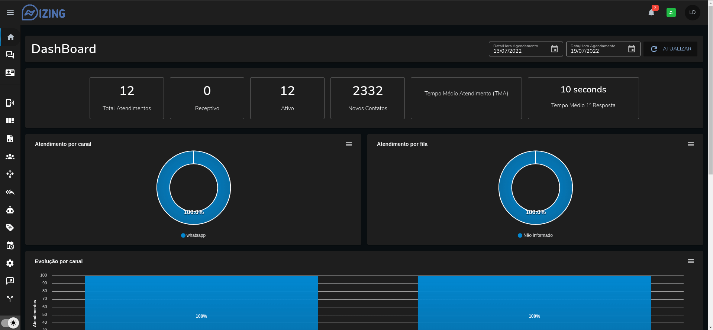

# Izing

Um sistema para gestão de atendimento multicanais centralizado.

**IMPORTANTE**: não garantimos que a utilização desta ferramenta não irá gerar bloqueio nas contas utilizadas. São bots que em sua maioria utilizam APIs secundarias para comunicação com os fornecedores dos serviços. Use com responsabilidade!

 

## Screenshots

 

 

___

 

## Principais funcionalidades

- Multíplos canais de atendimento ✅
- Multíplos usuários simultâneos por canais de atendimento ✅
- Iniciar conversa com contatos existentes (whatsapp) ✅
- Construção de Chatbot interativo ✅
- Enviar e receber mensagens ✅
- Enviar e receber mídias diversas (imagens/áudio/documentos) ✅
- Multiempresas (abordagem de base compartilhada)

 

## Instalando
Seguem links sugerimos:
-  [Como Instalar o IZING - Método 2023](https://www.youtube.com/watch?v=0j1v6m4Nk74&t=379s)

 

## Atualizando

Izing é um trabalho em progresso e estamos frequentemente adicionando novas funcionalidades e correções de bugs.

 

**IMPORTANTE**: verifique sempre o .env.example e ajuste o seu .env antes de atualizar, uma vez que algumas novas variáveis podem ser adicionadas.

 

## FIQUE ATENTO

A utilização desta ferramenta é feita por sua conta e risco. O código é aberto e todos podem contribuir.

Este projeto não é afiliado, associado, autorizado, endossado por, ou de qualquer forma oficialmente ligado à WhatsApp, ou a qualquer uma das suas filiais ou afiliadas. O website oficial da WhatsApp pode ser encontrado em <https://whatsapp.com>. "WhatsApp", bem como nomes, marcas, emblemas e imagens relacionadas são marcas registadas dos seus respectivos proprietários.

--------------------------
 

#### Curtiu? Apoie o projeto!! Com sua doação, será possível continuar com as atualizações. Segue QR code (PIX)  

--------------------------
 

## **Licença e seus requerimentos**

Izing é open-source, licenciado com base na licença GNU Affero General Public License Version 3 [(AGPLv3)](https://www.gnu.org/licenses/agpl-3.0.pt-br.html). O objetivo da licença AGPL é maximizar a liberdade do usuário e incentivar as empresas a contribuir com o código aberto.

Você pode usar o izing em sua própria estrutura, desde que não seja para fins de comercialização.
Você pode fazer um fork do projeto para realizar suas alterações, implementar os recursos desejados, mas deverá abrir o código para a comunidade, conforme previsto pela licença. 

Uma vez que você deseje utilizar o izing para fins comerciais, todas as suas alterações, seu código fonte, precisa ser aberto (open source) para acesso pela comunidade, conforme licença. Bem como, deverá de forma clara, evidenciar aos seus usuários/clientes em menção de destaque ao projeto oficial (https://izing.io). Também é requerido a menção que você fornece uma versão alterada do izing e, em algum lugar do seu site, deverá fornecer o link para o repositório do seu projeto, permitindo que todos possam verificar as mudanças realizadas.

